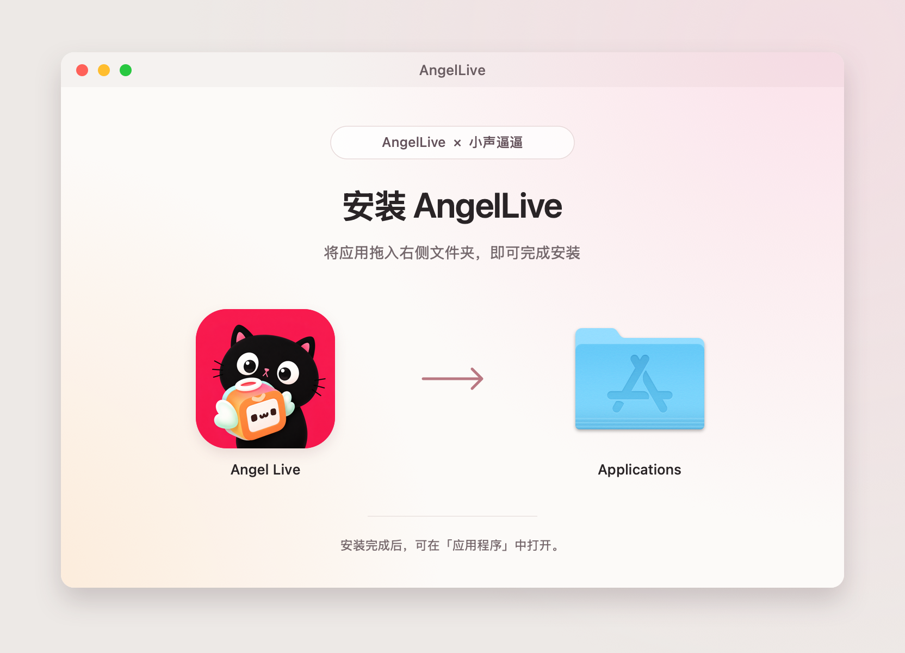

# AngelLive 联名 DMG 安装窗口

浅暖白背景，右上淡粉、左下淡橙，沿用 AngelLive × 小声逼逼联名图标。中央保留从应用到 Applications 的拖拽路径，使用系统应用程序文件夹图标。界面只说明安装动作与安装后的打开位置。



## 文件

| 文件 | 用途 |
| --- | --- |
| `background.tiff` | 正式 DMG 背景，包含 1× / 2× 两个分辨率 |
| `background.png` | 720 × 460 px，72 DPI |
| `background@2x.png` | 1440 × 920 px，144 DPI |
| `preview.png` | 1664 × 1200 px 的安装窗口设计预览，含示意图标和窗口边框 |
| `layout.json` | 文案、窗口尺寸和图标位置 |
| `render.swift` | 使用系统字体、AppKit 和现有联名资源重新导出素材 |
| `dmg-settings.py` | dmgbuild 的可复用 Finder 布局配置 |

实际打包使用 `background.tiff`。背景中没有绘制应用、文件夹或它们的名称；这些由 Finder 根据真实 `.app` 和 `/Applications` 链接显示，保持拖拽、键盘操作和系统菜单可用。`preview.png` 只用于设计评审。

## 布局

窗口内容区为 720 × 460 pt；应用图标中心 `(188, 268)`，Applications 中心 `(532, 268)`；图标尺寸 128 pt，文件名 13 pt。坐标以内容区左上角为原点。关闭工具栏、侧栏、路径栏和状态栏，使用固定图标位置。

## 重新导出背景

从仓库中的任意目录执行，使用当前已选择的 Xcode 工具链：

```sh
dmg_assets_dir="$(git rev-parse --show-toplevel)/macOS/Distribution/DMG"
xcrun swift -swift-version 6 "$dmg_assets_dir/render.swift"
tiffutil -cathidpicheck "$dmg_assets_dir/background.png" "$dmg_assets_dir/background@2x.png" -out "$dmg_assets_dir/background.tiff"
```

## 接入打包

使用已导出的 macOS `.app`。安装打包工具到独立临时环境后，替换下面的应用路径和输出路径：

```sh
dmg_assets_dir="$(git rev-parse --show-toplevel)/macOS/Distribution/DMG"
dmg_tools_dir=$(mktemp -d "${TMPDIR:-/tmp}/angellive-dmg-tools.XXXXXX")
python3 -m venv "$dmg_tools_dir"
"$dmg_tools_dir/bin/python" -m pip install 'dmgbuild==1.6.7'
"$dmg_tools_dir/bin/dmgbuild" -s "$dmg_assets_dir/dmg-settings.py" -D "app=/path/to/Angel Live.app" "AngelLive" /path/to/AngelLive.dmg
```

配置读取实际 `.app` 文件名，因此应用名称带空格也能正确定位图标。打包使用 UDZO 压缩、HFS+ 文件系统和指向 `/Applications` 的符号链接。参数按 [dmgbuild 官方配置文档](https://dmgbuild.readthedocs.io/en/latest/settings.html) 配置。

## 验证范围

已使用 Xcode 27 RC 的 Swift 6 工具链重新渲染并检查 1× 背景、2× 安装窗口预览；TIFF 包含 720 × 460 / 72 DPI 和 1440 × 920 / 144 DPI 两个分辨率。已检查布局配置及图标位置，未执行应用构建、实际 DMG 挂载或分发签名、公证。正式打包后还应核对 Finder 中的图标位置、文件名显示及拖拽行为。
